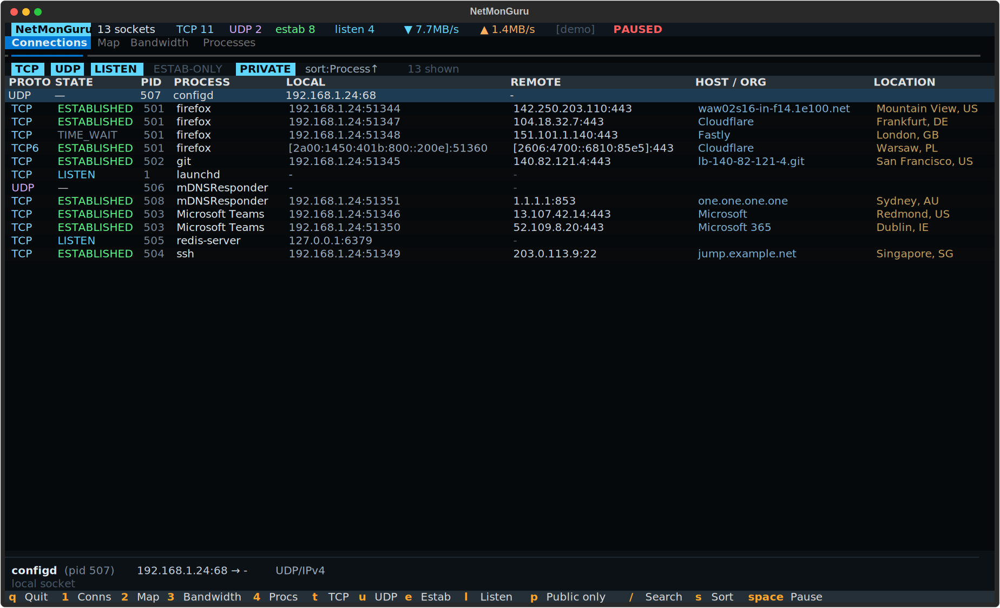
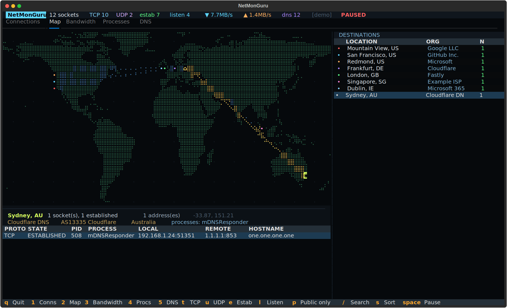

# NetMonGuru — build notes

```text
░█▀█░█▀▀░▀█▀░█▄█░█▀█░█▀█░█▀▀░█░█░█▀▄░█░█░░░█▀▄░█░█░░░█▀█░▀▀█░▀█▀░▀▀█░█▀▄
░█░█░█▀▀░░█░░█░█░█░█░█░█░█░█░█░█░█▀▄░█░█░░░█▀▄░░█░░░░█▀▀░░░█░░█░░░▀▄░█▀▄
░▀░▀░▀▀▀░░▀░░▀░▀░▀▀▀░▀░▀░▀▀▀░▀▀▀░▀░▀░▀▀▀░░░▀▀░░░▀░░░░▀░░░▀▀░░░▀░░▀▀░░▀░▀
```

btop-style network monitor for macOS, Python + Textual TUI. Delivered as
`netmonguru.zip`. Current version: **1.1.0** (2026-08-28).




## To run it:
unzip netmonguru.zip && cd netmonguru

python3 -m venv .venv && source .venv/bin/activate

pip install -e .

sudo netmonguru        # sudo → every socket gets a process name

Try netmonguru --demo first if you want to see it before granting root.
 
## Decisions taken with the user
- **Interface**: terminal TUI (Textual), tabbed panes — not a web dashboard.
- **GeoIP**: free API (`ip-api.com` batch) + 30-day disk cache; `ipwho.is`
  as automatic fallback; optional offline MaxMind `--mmdb`; `--no-geo` to
  disable outbound lookups entirely.
- **Depth**: per-process connections, per-interface bandwidth, per-process
  bandwidth (`nettop`), reverse DNS + ASN/org.
- **v1.1**: clickable map markers with an expanded per-connection detail
  pane; real-time DNS pane with a 15-minute rolling cache.
## Architecture
- `core/connections.py` — `lsof -nP -i -w +c 0 -F pcftPnT` field parser
  (process ownership) merged with `netstat -an` (system-wide completeness);
  `psutil` fallback. Without sudo, unattributed rows show `?`.
- `core/bandwidth.py` — psutil per-NIC counters → rates + 240-sample history;
  `nettop -P -L 1 -x -n -J bytes_in,bytes_out` CSV parser, deltas computed
  between our own runs.
- `core/procs.py` — groups sockets per PID, joins nettop throughput by pid
  then by name.
- `core/dnswatch.py` — three sources: `log stream` on mDNSResponder (gives
  the requesting process), `tcpdump` port 53 with transaction-id correlation
  (root only), and passive PTR of new remote addresses. `DNSCache` is a
  time-windowed store (default 900 s) with an address→name index; a forward
  answer always outranks a PTR guess, and that index feeds the HOST column
  of the connections pane.
- `core/enrich.py` — background queue worker, only public/routable IPs leave
  the machine; cache at `~/.cache/netmonguru/geoip.json`.
- `core/monitor.py` — sampling thread publishing immutable `Snapshot`s; UI
  polls at 2 Hz and never blocks on I/O. `--demo` yields synthetic sockets
  and synthetic DNS traffic.
- `ui/widgets/braille.py` — 2×4 braille canvas (bitmap, Bresenham lines,
  bottom-anchored bar graphs).
- `ui/widgets/worldmap.py` — projection, size-scaled markers, arcs, and a
  cell→marker index used for mouse hit-testing (`CLICK_RADIUS` = 2 cells).
- `data/landmask.py` — 720×360 world land mask generated offline from
  `global-land-mask`, embedded as zlib+base64 (~6.5 KB), zero runtime deps.
## Textual gotchas hit (worth remembering)
- Punctuation key names are `full_stop` / `comma`, not `period`.
- A focused widget left behind in a hidden `TabPane` makes `TabbedContent`
  snap back to that pane — `action_show_tab` must move focus into the new
  pane (`TAB_FOCUS` map).
- A hidden (`display: none`) `Input` still wins `AUTO_FOCUS` and swallows
  every keystroke; set `AUTO_FOCUS` explicitly.
- `DataTable.move_cursor` posts `RowHighlighted` asynchronously, so a
  boolean "I'm syncing" flag does not suppress it — gate on `has_focus`.
- Messages keep dispatching during teardown; every render helper resolves
  widgets through a tolerant `_find` instead of `query_one`.
## Verification done
- 37 unit tests: lsof/netstat/nettop parsers, merge dedup, address
  classification, landmask, graph helpers, process aggregation, DNS log and
  tcpdump parsers, cache eviction/priority/rate series.
- `tests/smoke_ui.py` drives the real TUI headless: clicks an actual map
  marker at its rendered coordinates and asserts the correct connections
  were expanded, asserts an empty-ocean click is ignored, checks pane
  switching after a click, and exercises both search paths.
- Real `lsof` collection and passive PTR verified end-to-end in a Linux
  container; `--dns-capture pcap` verified to degrade cleanly when tcpdump
  is absent.
## Not verified in the build environment
- Live geolocation: the sandbox proxy returns 403 for ip-api.com and
  ipwho.is, so the network path was exercised only through error handling.
- `nettop` and `log stream` (macOS-only binaries) — parsers tested against
  captured/representative output, not a live run. `log stream` message
  formats vary by macOS release; the parser is shape-based and the pane
  reports the live source plus any error.
## Possible next steps
- Alert rules (new country, new listening port, unexpected process, a name
  resolved that was never seen before).
- Export of the socket table and the DNS cache to CSV/JSON for audit
  evidence.
- Per-connection throughput (needs `pktap`/`tcpdump`, root only).
