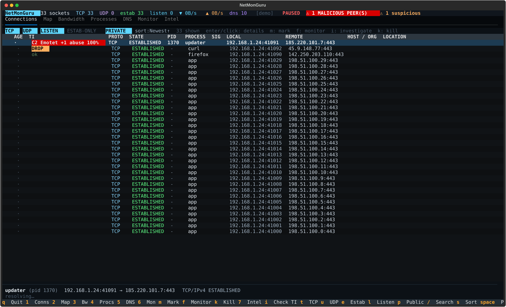
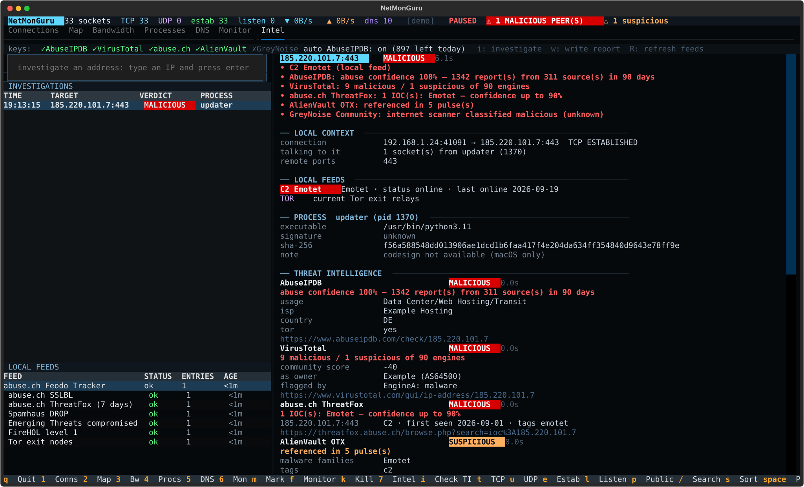
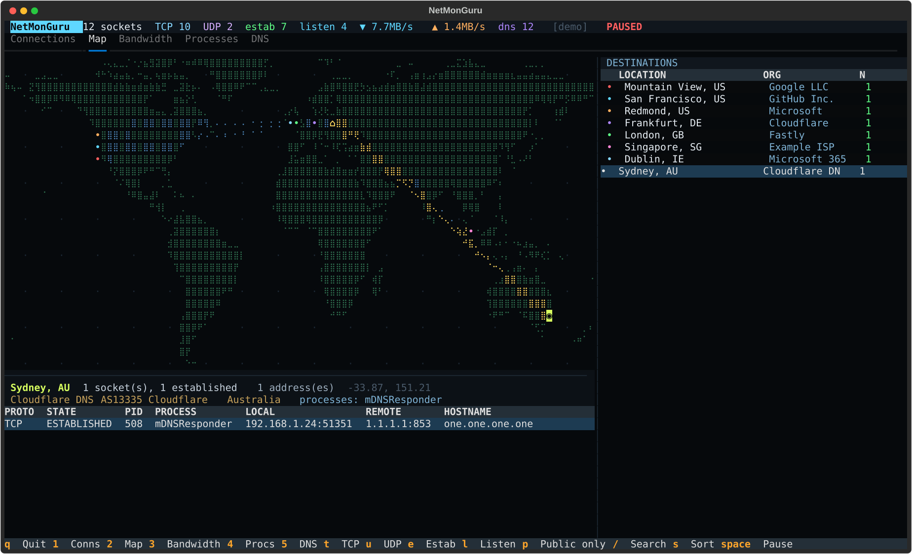

# NetMonGuru

```text
░█▀█░█▀▀░▀█▀░█▄█░█▀█░█▀█░█▀▀░█░█░█▀▄░█░█░░░█▀▄░█░█░░░█▀█░▀▀█░▀█▀░▀▀█░█▀▄
░█░█░█▀▀░░█░░█░█░█░█░█░█░█░█░█░█░█▀▄░█░█░░░█▀▄░░█░░░░█▀▀░░░█░░█░░░▀▄░█▀▄
░▀░▀░▀▀▀░░▀░░▀░▀░▀▀▀░▀░▀░▀▀▀░▀▀▀░▀░▀░▀▀▀░░░▀▀░░░▀░░░░▀░░░▀▀░░░▀░░▀▀░░▀░▀
```

**Current version: 1.3.0** — see [CHANGELOG.md](CHANGELOG.md) for what is new.
The previous release (1.1.0) is kept in [`old-version-V1/`](old-version-V1/).

### sudo buy me a coffee
This tool has no telemetry, no ads, and no budget. Coffee helps.
Powered by curiosity, maintained on caffeine.
https://buycoffee.to/blackopsninja








A btop-style network monitor for macOS, in the terminal. Seven panes over one
live picture of what your Mac is talking to:

| Pane | Key | What it shows |
|------|-----|---------------|
| **Connections** | `1` | Every TCP/UDP socket: protocol, state, owning process, local → remote endpoint, hostname, owning organisation and geographic location. Filter by protocol, state, or free text. New sockets always appear at the top, flagged `NEW`. **Click a row (or press Enter)** to expand full details with the related processes; `m` marks rows, `f` sends them to the Monitor. |
| **Map** | `2` | A braille world map with one marker per remote location and arcs from your own location. **Click a marker** to highlight its arc and expand every connection to that place underneath. |
| **Bandwidth** | `3` | btop-style download/upload graphs (auto-scaled, shared axis) over a 4-minute rolling window, plus a per-interface table with rates, totals and sparklines. |
| **Processes** | `4` | Per-process view: throughput from `nettop`, socket counts, established connections, distinct peers and listening ports. |
| **DNS** | `5` | Every name resolution as it happens — time, source, requesting process, type, query, answers — plus a rolling 15-minute cache keyed by name, and a resolutions-per-bucket graph. |
| **Intel** | `7` | Threat intelligence: on-demand investigation of an address (reputation sources, WHOIS/RDAP, OSINT, owning process), history of investigations, state of the local feeds. |
| **Monitor** | `6` | Only the traffic you chose to watch: the rules you created from marked connections, every live socket that matches them (new on top) and a history of the ones that have closed. |

## Install

```bash
cd netmonguru
python3 -m venv .venv && source .venv/bin/activate
pip install -e .
netmonguru
```

Or without installing:

```bash
pip install -r requirements.txt
python3 -m netmonguru
```

Requires Python 3.9+. Dependencies: `textual`, `rich`, `psutil` — all pure
Python, no compiler needed.

## Privileges

macOS does not let an unprivileged process read another process's file table,
so NetMonGuru merges two sources:

* `lsof -i` — gives **process ownership**, but only for processes you may
  inspect.
* `netstat -an` — gives **every socket on the system**, but no ownership.

Run it normally and you see all sockets, with process names filled in for your
own processes and `?` for the rest. Run it with `sudo` and every row gets a
process name:

```bash
sudo netmonguru
```

The status bar shows `unprivileged` when running without root, and which
backends are active (`lsof+netstat`).

## The map

Markers are sized by how many sockets share a location and coloured to match
the destination list on the right. Interaction:

* **Click a marker** — selects it, draws its arc in full, and fills the panel
  underneath with every socket to that location (process, pid, local → remote,
  hostname).
* **Click a row in the destination list** — same thing, from the keyboard side.
* `,` / `.` — step through markers without the mouse.
* `a` — hide/show the background arcs.
* Hovering a marker shows a tooltip with its location and socket count.

The home marker (`⌂`) is your own public location, resolved once at startup;
with `--no-geo` or an offline database that has no answer for your address, the
arcs are simply not drawn.

## Watching DNS

The DNS pane answers "what did this machine look up, and who asked for it".
Three sources, picked automatically (`--dns-capture` overrides):

| Mode | How | Needs | Sees |
|------|-----|-------|------|
| `log` | `log stream` filtered to `mDNSResponder` | nothing (more detail under `sudo`) | everything resolved through the system resolver, **with the requesting process** |
| `pcap` | `tcpdump` on port 53 | root | plaintext DNS on the wire, including apps that bypass the system resolver |
| `passive` | reverse (PTR) lookup of each new remote address | nothing | which names the addresses you talk to belong to |

`passive` always runs alongside the others as a backstop, so the pane is never
empty. A name observed being resolved always wins over a PTR guess, both in
the cache and in the `HOST` column of the Connections pane.

Everything is kept for **15 minutes** (`--dns-window SEC`) in memory only —
nothing is written to disk. The cache table shows, per name: every address seen
for it, how many times it was resolved, how long ago, and the TTL when the
source reports one. `/` filters the live list and the cache together.

Caveat worth knowing: DNS-over-HTTPS bypasses both `log` and `pcap`. A browser
with DoH enabled will show connections whose names only the `passive` source
can guess.

## Geolocation and privacy

Only **public, routable** addresses are ever looked up. Private, loopback,
link-local and multicast addresses are labelled locally and never leave the
machine. Results are cached in `~/.cache/netmonguru/geoip.json` for 30 days,
so a typical session makes only a handful of requests.

By default lookups go to `ip-api.com` (free, no key, batched, 15 requests per
minute), with `ipwho.is` as an automatic fallback if that endpoint is blocked.
Two alternatives:

```bash
netmonguru --no-geo --no-ti                  # no outbound lookups at all
netmonguru --mmdb ~/GeoLite2-City.mmdb \
           --mmdb-asn ~/GeoLite2-ASN.mmdb    # fully offline (pip install netmonguru[offline-geo])
```

`--no-dns` additionally disables reverse-DNS resolution.

## Connection details

Click a row in **Connections** (a single click is enough) or press `Enter` and
the bottom of the pane expands into a detail panel that follows the cursor:

* the socket itself — state, local/remote endpoint, service name, address
  class, when it was first seen;
* the remote side — observed DNS name, PTR, owning organisation, ASN, location;
* the owning process — executable path, user, parent, uptime, memory, command
  line (other users' processes need `sudo`);
* **Related processes** — the owner, every other process talking to the same
  remote address (`same peer`) and other instances of the same program
  (`same app`), with their throughput and socket counts. `Enter`/click on one
  opens it in the Processes pane; `g` jumps straight to the owner;
* every other socket the owning process holds.

`Esc` closes the panel.

## Monitoring selected traffic

1. In **Connections** press `m` on each connection you care about (the cursor
   advances, so `m m m` marks three in a row; `x` clears the marks).
2. Press `f` — "apply filter to these". The marked connections (or just the
   highlighted one when nothing is marked) become rules and the **Monitor**
   pane opens.
3. Go back and repeat at any time: new rules are added to the existing ones.

A socket is short-lived — the local port changes on every reconnect — so a
rule describes the *conversation*, not the socket:

| Key | Rule scope | Matches |
|-----|-----------|---------|
| `f` | endpoint | same process + protocol + remote address (or observed hostname) + remote port |
| `F` | host | anything, from any process, to that remote address / hostname |
| `P` | process | everything the process does |

Listening sockets become `listen` rules (process + protocol + local port).

The Monitor pane shows the rules (live / total sockets, last seen) and below
them the matching traffic: live sockets first with the newest on top, then the
closed ones with first-seen time and duration — a small audit trail of what
the watched process or host did while you were not looking. `d` deletes the
rule under the cursor, `c` clears closed history, `Enter` on a live row opens
it back in Connections. Monitored rows carry a `◉` in the Connections pane and
the summary bar shows the live monitored count.

Rules are saved to `~/.config/netmonguru/monitor.json` and restored on start.

## Threat intelligence

Three layers, in increasing order of what leaves your machine.

**1. Local feeds → the `TI` column (nothing leaves).** Blocklists are
downloaded whole every 6 h, cached in `~/.cache/netmonguru/feeds/` and matched
in memory: abuse.ch Feodo Tracker (botnet C2), abuse.ch SSLBL (C2 by
certificate), abuse.ch ThreatFox (ip:port IOCs of the last 7 days — needs the
free abuse.ch key), Spamhaus DROP, Emerging Threats compromised hosts, FireHOL
level 1, Tor exit nodes. A hit shows as `C2 Emotet`, `IOC Cobalt Strike`,
`DROP`, `TOR`… A **malicious** hit pins the connection to the top of the list
and raises a red warning in the summary bar.

**2. Automatic AbuseIPDB check (one address → one lookup per 24 h).** With an
AbuseIPDB key configured every new public peer is looked up once; the result
(`ok`, `abuse 87%`) joins the `TI` column. Peers with a feed hit are checked
first, results are cached on disk, and a daily budget of 900 keeps you inside
the free tier (1000/day). This discloses the addresses you talk to to
AbuseIPDB — turn it off with `--no-ti-auto` on engagements where that matters.

**3. Investigation on demand → the Intel pane.** Press `i` on a connection
(Connections, Monitor, Map) or type an address in the Intel pane. In parallel:

| Group | Sources |
|-------|---------|
| Reputation | AbuseIPDB, VirusTotal, abuse.ch ThreatFox, AlienVault OTX, GreyNoise Community |
| WHOIS | RDAP (registry data: netblock, holder, abuse contact, dates) and the `whois` command |
| OSINT | Shodan InternetDB (open ports, software, CVEs, tags — no key), DNS (PTR, forward confirmation), crt.sh certificate transparency for the observed hostname |
| Process | code signature (`codesign`), Gatekeeper (`spctl`), launch-path heuristics, SHA-256 of the binary → VirusTotal (**only the hash is sent**) |
| Local | what this machine knows: sockets and processes talking to the address, ports, names resolved, monitor rules |

The report ends in one verdict — `MALICIOUS`, `SUSPICIOUS`, `CLEAN` or
`UNKNOWN` (no reputation source answered; an empty answer is never reported as
clean) — with the list of who claimed what. `w` writes it to
`~/netmonguru-reports/<ip>-<time>.md` and `.json` as audit evidence; `R`
re-downloads the feeds.

The `SIG` column shows who signed the owning binary (`apple`, `dev-id`,
`store`, `ad-hoc`, `UNSIGNED`, `INVALID`); a `!` marks a suspicious launch
path (`/tmp`, Downloads, hidden directory…). Unsigned **and** oddly placed is
flagged red.

**API keys** — all optional, a source without a key is skipped. Put them in
`~/.config/netmonguru/keys.toml` (created on first run, mode 600):

```toml
abuseipdb  = "…"   # https://www.abuseipdb.com/account/api    1000 checks/day
virustotal = "…"   # https://www.virustotal.com/gui/my-apikey 500/day, 4/min
abusech    = "…"   # https://auth.abuse.ch/                   ThreatFox
otx        = "…"   # https://otx.alienvault.com/api
greynoise  = "…"   # optional - 10 lookups/day without a key
```

or export `ABUSEIPDB_KEY`, `VT_API_KEY`, `ABUSECH_AUTH_KEY`, `OTX_API_KEY`,
`GREYNOISE_KEY`. Note that VirusTotal's *public* key is licensed for
non-commercial use only. `--no-ti` disables the whole subsystem.

## Ending a connection

Press `k` on a connection (Connections, Monitor or the Map detail table). A
confirmation dialog offers:

| Key | Action | Effect |
|-----|--------|--------|
| `c` | **cut this connection only** | Loads `block return` rules for the exact local:port ⇄ remote:port pair into a private pf anchor and kills the matching states. No further packet gets through and the next one from either side is answered with a TCP reset. The process keeps running; a reconnect (new local port) is not blocked. **Needs `sudo`.** |
| `t` | terminate the process | `SIGTERM` — the kernel closes every socket the process holds, immediately. |
| `K` | force kill | `SIGKILL`. |

macOS offers no supported way to close a single socket owned by another
process, which is why the choice is "filter it" or "stop its owner". Notes on
the pf route: an *idle* connection stays listed until one side sends something
and receives the reset; pf is enabled with a reference token (`pfctl -E`) and
on exit NetMonGuru flushes its anchor (`com.apple/250.NetMonGuru`) and
releases the token, so nothing in `/etc/pf.conf` is touched. If the app is
killed hard, clean up with
`sudo pfctl -a com.apple/250.NetMonGuru -F rules`.

## Keys

```
1 … 7        switch pane
enter/click  connection details        esc     close details / clear search
m / x        mark row / unmark all     f F P   monitor marked: endpoint/host/process
g            go to owning process      d / c   (Monitor) delete rule / clear closed
k            end connection (cut / terminate / kill, with confirmation)
i            investigate address (TI + whois + OSINT) → Intel pane (7)
w / R        (Intel) write report to disk / refresh feeds
s          cycle sort (Newest first…)  t / u   toggle TCP / UDP
/          search (process, ip, port,  e       established only
           country, org, hostname)     l       show/hide listening sockets
                                       p       public destinations only
r          reverse sort                a       toggle map arcs
space      pause sampling              , .     previous / next map marker
q          quit                        n       cycle bandwidth interface
esc        clear search
```

## Command line

```
-i, --interval SEC     sampling interval (default 2.0)
    --no-geo           never send addresses to a geolocation service
    --no-dns           skip reverse DNS
    --no-ti            no threat intelligence at all (no feed downloads, no lookups)
    --no-ti-auto       feeds + manual investigation only; never auto-query AbuseIPDB
    --no-netstat       do not merge the system-wide netstat socket table
    --no-proc-bw       disable per-process bandwidth (nettop)
    --mmdb PATH        offline MaxMind GeoLite2-City database
    --mmdb-asn PATH    optional GeoLite2-ASN database
    --dns-capture M    auto | log | pcap | passive | off   (default: auto)
    --dns-window SEC   DNS retention window (default 900 = 15 minutes)
    --dns-iface IF     interface for --dns-capture pcap
    --demo             synthetic data (useful for trying it off macOS)
    --dump             print one plain-text sample and exit (scriptable)
```

`--dump` is handy in pipelines:

```bash
sudo netmonguru --dump | grep ESTABLISHED
```

## How it works

```
netmonguru/
  core/
    connections.py   lsof -F field parser + netstat parser + merge
    bandwidth.py     psutil per-NIC counters → rates; nettop CSV parser
    procs.py         groups sockets per process, joins nettop throughput
    dnswatch.py      log stream / tcpdump / PTR sources → 15-min DNSCache
    enrich.py        background geo/ASN worker with a 30-day disk cache
    monitor.py       sampling thread producing immutable Snapshots
    models.py        Connection / GeoInfo / NicSample / Snapshot
  ui/
    app.py           Textual application, five tabs over one snapshot
    widgets/
      braille.py     2×4 braille canvas: bitmap, line drawing, bar graphs
      worldmap.py    projection, markers, arcs, hit-testing for clicks
      graph.py       stacked bandwidth graph + single-series mini graph
  data/
    landmask.py      720×360 world land mask, zlib+base64, no runtime deps
```

Sampling runs on its own thread and publishes a `Snapshot`; the UI reads the
latest snapshot at 2 Hz and never blocks on I/O. Geolocation runs on a third
thread behind a queue and the DNS capture on a fourth, reading its subprocess
line by line — a slow lookup service or a dead capture degrades to empty
columns rather than a frozen UI.

## Tests

```bash
python3 -m unittest discover -s tests    # 80 parser / cache / monitor / kill / threat-intel tests
python3 tests/smoke_ui.py                # headless UI run, writes screenshots/
python3 tests/smoke_monitor.py           # scrolling, new-on-top, details, marking, Monitor pane
python3 tests/smoke_intel.py             # TI column, investigation, Intel pane (canned upstream answers)
```

The smoke test drives the real TUI through Textual's headless pilot: it clicks
an actual map marker at its rendered coordinates and asserts the right
connections were expanded, checks that a click on empty ocean is ignored, walks
every pane, and exercises both search paths. Screenshots of each pane land in
`screenshots/`.

## Notes and limits

* `nettop` reports throughput for processes you may inspect; run under `sudo`
  for full coverage. If it is missing or restricted, the Processes pane still
  shows socket ownership and the throughput columns read `-`.
* `log stream` message formats differ between macOS releases. The parser keys
  on the `<name> <TYPE> <value>` shape rather than a fixed layout, and the pane
  reports which source is live plus any error; if it comes up empty on your
  release, `--dns-capture pcap` (with `sudo`) is the fallback.
* Map markers are bucketed to 0.1° so several peers in the same datacenter
  share one dot; the detail panel lists every socket behind the dot.
* IP geolocation is approximate by nature — city-level accuracy is typically
  good for consumer ISPs and poor for cloud/CDN ranges (a Cloudflare address
  will point at the anycast POP, not the origin).
